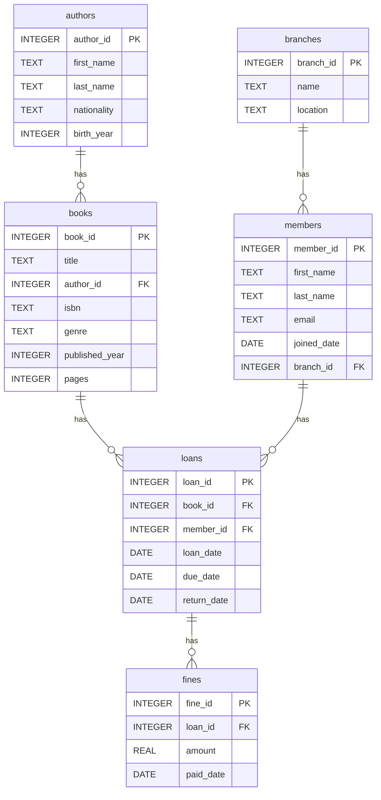

```mermaid
erDiagram
  branches {
    INTEGER branch_id PK
    TEXT name 
    TEXT location 
  }
  authors {
    INTEGER author_id PK
    TEXT first_name 
    TEXT last_name 
    TEXT nationality 
    INTEGER birth_year 
  }
  books {
    INTEGER book_id PK
    TEXT title 
    INTEGER author_id FK
    TEXT isbn 
    TEXT genre 
    INTEGER published_year 
    INTEGER pages 
  }
  members {
    INTEGER member_id PK
    TEXT first_name 
    TEXT last_name 
    TEXT email 
    DATE joined_date 
    INTEGER branch_id FK
  }
  loans {
    INTEGER loan_id PK
    INTEGER book_id FK
    INTEGER member_id FK
    DATE loan_date 
    DATE due_date 
    DATE return_date 
  }
  fines {
    INTEGER fine_id PK
    INTEGER loan_id FK
    REAL amount 
    DATE paid_date 
  }
  authors ||--o{ books : "has"
  branches ||--o{ members : "has"
  books ||--o{ loans : "has"
  members ||--o{ loans : "has"
  loans ||--o{ fines : "has"
```
